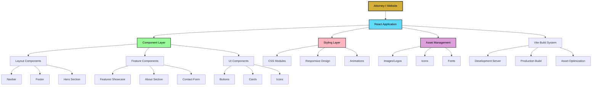
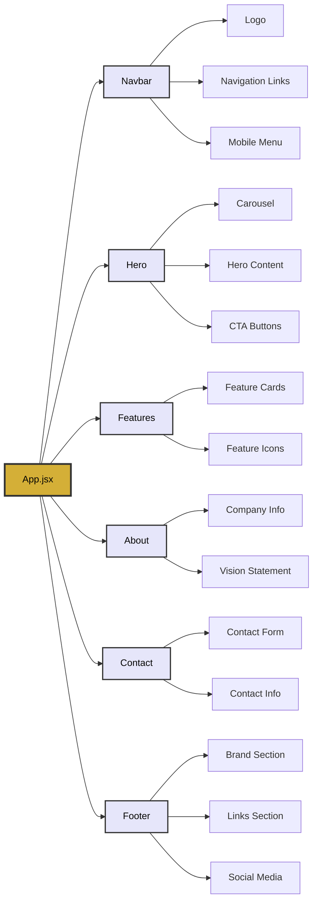

# Attorney-I Website

<div align="center">
  
  
  **Your AI Legal Assistant. Reimagined.**
  
  [](https://reactjs.org/)
  [](https://vitejs.dev/)
  [](LICENSE)
  [](https://attorney-i.vercel.app)
</div>

## 📋 Table of Contents

- [Overview](#overview)
- [Features](#features)
- [Technology Stack](#technology-stack)
- [Architecture](#architecture)
- [Project Structure](#project-structure)
- [Installation](#installation)
- [Development](#development)
- [Deployment](#deployment)
- [Component Documentation](#component-documentation)
- [Contributing](#contributing)
- [Contact](#contact)

## 🎯 Overview

Attorney-I is a modern, responsive company website for an AI-powered legal assistant platform. Built with React and Vite, the website showcases the Attorney-I application's features, provides company information, and serves as the primary digital presence for the brand.

The website emphasizes user experience with smooth animations, responsive design, and accessibility-first approach, targeting legal professionals and individuals seeking AI-assisted legal services.

## ✨ Features

### Core Functionality
- **Responsive Design** - Optimized for all devices and screen sizes
- **Interactive Navigation** - Smooth scroll navigation with fixed navbar
- **Hero Carousel** - Interactive 3D carousel showcasing app screens
- **Contact Integration** - Direct email and phone contact capabilities
- **Social Media Links** - Professional social media presence
- **SEO Optimized** - Meta tags and semantic HTML structure

### Design Highlights
- **Modern UI/UX** - Clean, professional design with gold accent theme
- **Smooth Animations** - CSS transitions and hover effects
- **Mobile-First** - Progressive enhancement from mobile to desktop
- **Accessibility** - WCAG compliant with proper ARIA labels
- **Fast Loading** - Optimized assets and lazy loading implementation

## 🛠 Technology Stack

### Frontend Framework
- **React 19.1.0** - Component-based UI library
- **React DOM 19.1.0** - DOM rendering for React

### Build Tools
- **Vite 7.0.4** - Next-generation frontend tooling
- **@vitejs/plugin-react 4.6.0** - React plugin for Vite

### Development Tools
- **ESLint 9.30.1** - Code linting and quality assurance
- **React Hooks ESLint Plugin** - React-specific linting rules
- **React Refresh Plugin** - Hot module replacement for development

### Styling & Assets
- **CSS3** - Custom styling with CSS variables and modern features
- **Playfair Display Font** - Professional typography
- **Custom Icons** - Curated icon set for social media and UI elements

## 🏗 Architecture



### Component Architecture



## 📁 Project Structure

```
attorney-i/
├── public/                     # Static assets
│   ├── vite.svg               # Vite logo
│   └── logo.png               # Main logo
├── src/                       # Source code
│   ├── components/            # React components
│   │   ├── Navbar.jsx         # Navigation component
│   │   ├── Hero.jsx           # Hero section with carousel
│   │   ├── Features.jsx       # Features showcase
│   │   ├── About.jsx          # About section
│   │   ├── Contact.jsx        # Contact section
│   │   ├── Footer.jsx         # Footer component
│   │   ├── Action.jsx         # CTA section (disabled)
│   │   ├── Download.jsx       # Download section (disabled)
│   │   └── Testimonials.jsx   # Testimonials (disabled)
│   ├── assets/                # Asset files
│   │   ├── icons/             # Icon collection
│   │   │   ├── gmail-logo.png
│   │   │   ├── instagram-logo.png
│   │   │   ├── internet-logo.png
│   │   │   └── linkedin-logo.png
│   │   ├── carouselscreens/   # Carousel images
│   │   ├── logo.png           # Brand logo
│   │   ├── logo-black.png     # Dark variant logo
│   │   ├── logo-removebg.png  # Transparent logo
│   │   └── react.svg          # React logo
│   ├── App.jsx                # Main application component
│   ├── App.css                # Global application styles
│   ├── main.jsx               # Application entry point
│   └── index.css              # Base CSS styles
├── eslint.config.js           # ESLint configuration
├── vite.config.js             # Vite configuration
├── package.json               # Project dependencies
├── index.html                 # HTML template
└── README.md                  # Project documentation
```

## 🚀 Installation

### Prerequisites
- **Node.js** (v16.0.0 or higher)
- **npm** or **yarn** package manager
- **Git** for version control

### Clone Repository
```bash
git clone https://github.com/ayaxan7/AttroneyI-Web.git
cd attorney-i
```

### Install Dependencies
```bash
npm install
# or
yarn install
```

## 🔧 Development

### Start Development Server
```bash
npm run dev
# or
yarn dev
```

The development server will start at `http://localhost:5173` with hot module replacement enabled.

### Code Linting
```bash
npm run lint
# or
yarn lint
```

### Build for Production
```bash
npm run build
# or
yarn build
```

### Preview Production Build
```bash
npm run preview
# or
yarn preview
```

## Deployment

### Build Process
1. **Install Dependencies**: `npm install`
2. **Run Build**: `npm run build`

### Recommended Platforms
- **Vercel** (Current deployment)
- **Netlify**
- **GitHub Pages**
- **AWS S3 + CloudFront**

### Environment Variables
No environment variables required for current implementation.

## Component Documentation

### Core Components

#### Navbar Component
- **Purpose**: Fixed navigation with responsive design
- **Features**: Smooth scrolling, mobile hamburger menu, centered branding
- **Files**: `Navbar.jsx`, `Navbar.css`

#### Hero Component
- **Purpose**: Main landing section with interactive carousel
- **Features**: 3D carousel, responsive arrows, mobile optimization
- **Files**: `Hero.jsx`, `Hero.css`

#### Features Component
- **Purpose**: Showcase application features
- **Features**: Feature cards, icons, responsive grid
- **Files**: `Features.jsx`, `Features.css`

#### Footer Component
- **Purpose**: Website footer with links and contact info
- **Features**: Responsive grid, social media links, company information
- **Files**: `Footer.jsx`, `Footer.css`

### Styling Guidelines
- **CSS Variables**: Consistent color scheme using CSS custom properties
- **Mobile-First**: Progressive enhancement from mobile to desktop
- **Flexbox/Grid**: Modern layout techniques for responsive design
- **Animations**: Smooth transitions and hover effects

## 🤝 Contributing

### Development Workflow
1. **Fork** the repository
2. **Create** feature branch (`git checkout -b feature/AmazingFeature`)
3. **Commit** changes (`git commit -m 'Add some AmazingFeature'`)
4. **Push** to branch (`git push origin feature/AmazingFeature`)
5. **Open** Pull Request

### Code Standards
- Follow ESLint configuration
- Use semantic HTML elements
- Implement responsive design principles
- Write clear, commented code
- Test on multiple devices/browsers

### Bug Reports
Please include:
- Browser and version
- Device and screen size
- Steps to reproduce
- Expected vs actual behavior

## 📞 Contact

### Project Information
- **Website**: [attorney-i.vercel.app](https://attorney-i.vercel.app)
- **Repository**: [github.com/ayaxan7/AttroneyI-Web](https://github.com/ayaxan7/AttroneyI-Web)

### Support
For technical support or business inquiries, please contact us through the website contact form or email directly.

---

<div align="center">
  <p><strong>Attorney-I © 2025. All rights reserved.</strong></p>
  <p><em>Attorney-I provides general legal information and should not be considered as legal advice. Always consult with qualified legal professionals for specific legal matters.</em></p>
</div>
